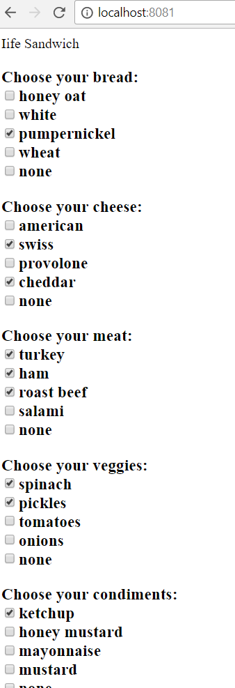

# Sandwich Maker


### Requirements
Create a sandwich order form that allows the user to select all the ingredients for a custom deli sandwich. Create a `Sandwich` module, then create the following as individual modules, using IIFE syntax, to augment `Sandwich`:  

+ bread
+ meat
+ cheese
+ condiments
+ veggies  

Your project should have one HTML file that has:

+ A section of options for each sandwich part 
+ The ability to select multiple, or zero, choices for each section (such as turkey _and_ bacon, or "no meat") 
+ An empty DOM element into which the final sandwich order and its cost will be inserted  

The ingredient choices should be stored as JS objects that contain the ingredients as keys and their cost as the value. `{"turkey": 0.90, "bacon": 1.50}` 

Make sure the ingredient objects cannot be accessed by the other modules except through an accessor (getter) method.  

Each IIFE should expose, in its public interface, a method named `add{ingredient}` (e.g. `addMeat` or `addVeggies`) that accepts a single argument. That argument's value should be the ingredient selected by the user.

You should also create an additional JavaScript file that handles interacting with the form elements and determining which method should be called.

> Don't worry about exposing the prices to the user until you display the final cost. This is just an exercise, not a business model.

Here's some simple boilerplate code to get you started.

##### SandwichMaker.js

```js
var SandwichMaker = (function() {

  // Private variable to store the price
  var totalPrice = 0;

  // Return the public interface that other code can interact with
  return {
    addTopping: function(toppingPrice) {
      totalPrice += toppingPrice;
    }
  };
})();

```

##### Meat.js

```js
// This SandwichMaker IIFE augments the original one
var SandwichMaker = (function(maker) {

  // Private variable to store the different meat prices
  var meatPrices;

  // Augment the original object with another method
  maker.addMeat = function() {
    return ???;
  };

  // Return the new, augmented object with the new method on it
  return maker;
})(SandwichMaker);
```

##### DOMHandler.js

```js

// Variable to hold the final price. Default to 0.
var finalSandwichPrice = 0;

// Variable to hold topping that the user selects
var selectedTopping;

// Get a reference to the <select> element that has all the meat options
var meatChooser = document.getElementById("meat-chooser");

/* 
  A <select> element broadcasts a change event, so you listen for it
  and get the value of the topping from your augmented IIFE
*/
meatChooser.addEventListener("change", function(event) {
  // Get the value chosen from the DOM
  selectedTopping = event.target.value;

  // Determine the price of the topping chosen

  // Add the topping to the SandwichMaker to increase the total price
});
```
### Screen Shots of the Project

This screen shot is on page load.


This screen shot is showing the various choices, and the user has made some selections.

;

This screen shot shows that the selected items are written in a separate div, and there is a running total.

;

### How do I run this project locally?

In order to run this project on your computer, please complete the following steps:
  1. Clone the project by clicking on the green "Clone or Download" button above.
  1. Run your terminal, type in git clone, then paste the information that was copied from github.
  1. Inside the project folder, type in http-server -c-1.
  1. Launch your internet browser and navigate to http://localhost:8080.
